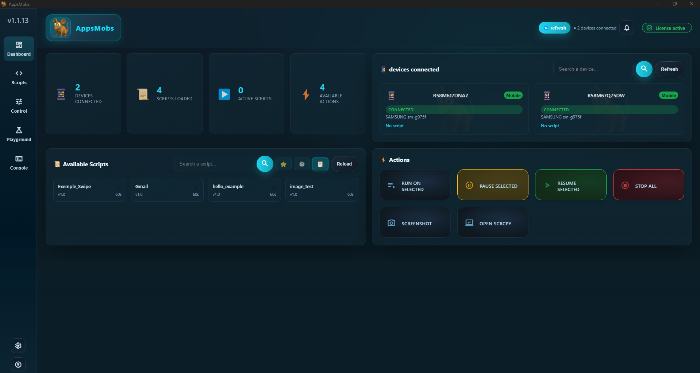
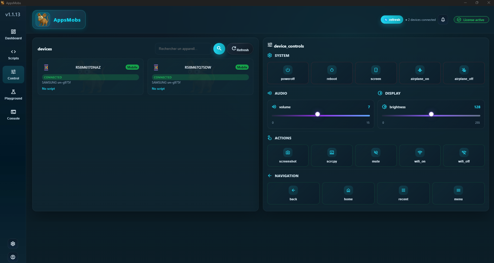
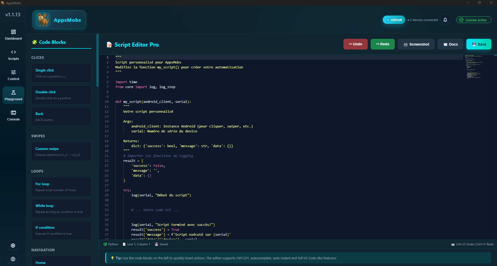
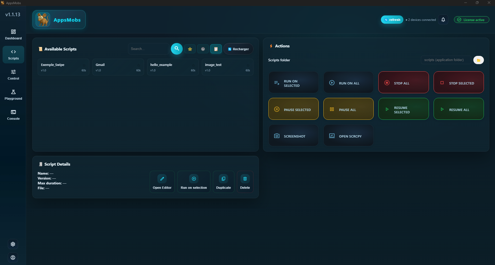
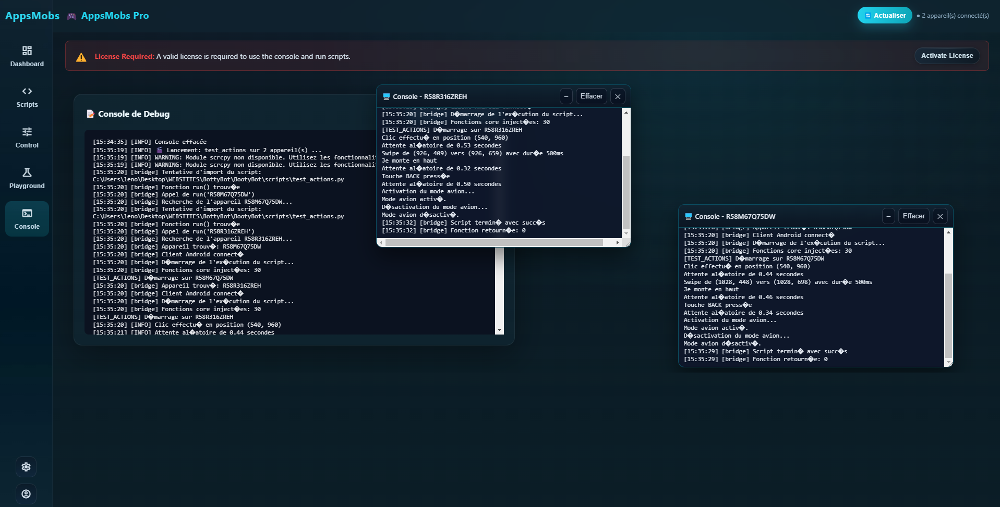
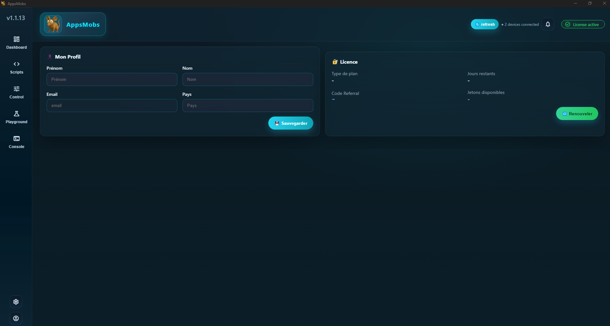
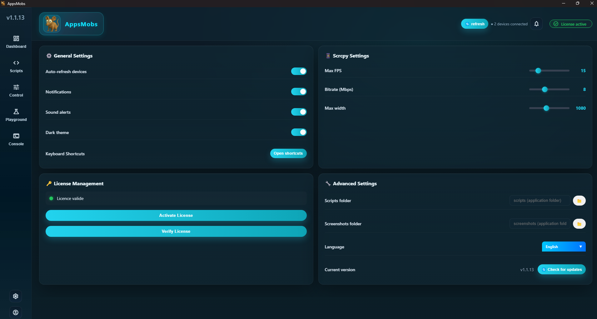

# AppsMobs - Android Automation Made Easy 🚀

[](https://www.microsoft.com/windows)
[](https://appsmobs.com/download)
[](https://appsmobs.com)
[](LICENSE.md)

> **Professional Android automation tool for Windows** - Control multiple devices, create Python scripts, and automate tasks with ease.

**🎯 Get Started**: Download the Windows installer (.exe) from [appsmobs.com/download](https://appsmobs.com/download)

## 📸 Screenshots

<div align="center">

### Dashboard - Multi-Device Management


### Device Control & Screen Mirroring


### Script Playground - Built-in Code Editor


### Scripts Management


### Console & Logs


### Profile & Settings



### License Management


</div>

> ⚠️ **Commercial Software**: AppsMobs is proprietary software distributed as a compiled Windows executable. This repository contains documentation, website source, and build tools - not the full application source code.

## ✨ Features

- 📱 **Multi-Device Control** - Manage multiple Android devices simultaneously
- 🐍 **Python Scripting** - 35+ built-in automation functions
- 🎯 **Image Recognition** - OpenCV-based visual detection
- 🔄 **Optimized Screen Mirroring** - High-performance scrcpy integration (2M bitrate)
- 💻 **Windows Desktop App** - Clean, modern GUI
- 🔐 **Flexible Licensing** - Free trials and paid plans
- ⚡ **Local Execution** - Everything runs on your PC, no cloud needed
- 🎨 **Script Editor** - Built-in Playground with code blocks

## 🎯 Perfect For

- **Developers** - Automate testing and deployment
- **Power Users** - Custom automation workflows
- **QA Teams** - Multi-device testing
- **Content Creators** - Repetitive task automation

## 🚀 Quick Start

### Download & Install

1. **Download**: Get the Windows installer from [appsmobs.com/download](https://appsmobs.com/download)
2. **Install**: Run the installer and follow the setup wizard
3. **Launch**: Start AppsMobs and connect your Android device
4. **License**: Get a free trial license from [appsmobs.com/shop](https://appsmobs.com/shop)

> 💡 **Note**: AppsMobs is distributed as a compiled Windows executable (.exe). No Python installation or coding knowledge required!

### Connect Your Device

1. Enable **Developer Options** on your Android device
2. Enable **USB Debugging**
3. Connect via USB cable
4. Accept the debugging prompt on your phone
5. Your device will appear in the Dashboard

### Your First Script

```python
def my_script(android_client, serial):
    """
    Your custom script entrypoint.
    
    Args:
        android_client: Android client instance (provided by runtime)
        serial: Device serial number
    
    Returns:
        dict: {'success': bool, 'message': str, 'data': {}}
    """
    result = {
        'success': False,
        'message': '',
        'data': {}
    }
    
    try:
        # Use helper functions provided by the runtime
        log(serial, "Script started")

        # Swipe down
        swipe_down()
        
        
        # Click at coordinates
        click(540, 960)
        
        
        # Double click
        doubleclick(540, 960)
        

        # Wait 1 second
        wait(1.0)

        # Find image
        find("image.png", 0.8)

        

        # Type text
        write("Hello AppsMobs!")
        

        log(serial, "Script finished successfully!")
        result['success'] = True
        result['message'] = f'Script executed on {serial}'
        result['data']['device'] = serial
    except Exception as e:
        log(serial, f"Error: {e}", "ERROR")
        result['success'] = False
        result['message'] = str(e)
        import traceback
        result['data']['traceback'] = traceback.format_exc()
    
    return result
```

## 📋 Requirements

- **OS**: Windows 10 or later (64-bit)
- **Python**: 3.9+ (included in installer)
- **Android**: USB Debugging enabled
- **Hardware**: USB cable (data-capable)

## 💰 Pricing

AppsMobs offers flexible pricing plans:

| Plan | Price | Devices | Features |
|------|-------|---------|----------|
| **Normal** | €9/month | 1 device | Full automation suite |
| **Pro** | €15/month | 3 devices | Priority support + API access |
| **Team** | €45/month | Unlimited | SSO + Audit logs |

**Special Launch Offer**: Get **70% OFF** with code `APPSBLACKFRIDAY25` (first 100 customers)

- Annual subscriptions save up to 20%
- Free weekly trials available with referral tokens
- Visit [appsmobs.com/shop](https://appsmobs.com/shop) to purchase

## 🎓 Documentation

- **[Getting Started Guide](https://appsmobs.com/docs/getting-started)** - Complete setup walkthrough
- **[API Reference](https://appsmobs.com/docs/playground)** - All 35+ functions documented
- **[Script Examples](https://appsmobs.com/docs/scripts)** - Real-world use cases
- **[FAQ](https://appsmobs.com/faq)** - Common questions answered

## 🛠️ Script Functions

AppsMobs provides 35+ built-in functions that are automatically available in your scripts. No imports needed!

### 📝 Logging & Utilities
- `log(serial, message, level="INFO")` - Log messages to console
- `log_step(serial, step_name)` - Log script steps
- `wait(seconds)` or `sleep(seconds)` - Wait/delay execution
- `random_delay(min_s, max_s)` - Random delay (anti-bot)

### 🖱️ Click & Touch Controls
- `click(x, y)` - Click at coordinates
- `doubleclick(x, y)` - Double-click at coordinates
- `long_press(x, y, duration_ms)` - Long press at coordinates
- `swipe(x1, y1, x2, y2, duration)` - Custom swipe from point A to B

### ⌨️ Navigation & Input
- `write(text)` - Type text into focused field
- `back()` - Press back button
- `home()` - Press home button
- `enter()` - Press enter/confirm key
- `switch_app()` - Open app switcher (multitasking)

### 👆 Directional Swipes
- `swipe_up()` or `upswipe()` - Swipe up
- `swipe_down()` or `downswipe()` - Swipe down
- `swipe_left()` or `leftswipe()` - Swipe left
- `swipe_right()` or `rightswipe()` - Swipe right

### 👁️ Image Recognition (OpenCV)

**Single Image Search (Recommended):**
- `find(image, confidence=0.8, region=None)` - **Find once**, returns `(x, y)` or `None` ⭐ **RECOMMENDED**
- `find_image(image, confidence, region)` - Alias for `find()`
- `image_exists(image, confidence, region)` - **Boolean check**, returns `True/False`
- `find_image_bool(image, confidence, region)` - Alias for `image_exists()`

**Continuous Search (Infinite Loop):**
- `find_loop(image, confidence, region)` - **Loop until found**, returns `(x, y)` when found

**Multiple Images:**
- `find_first_image(images, confidence, region)` - Loop until one image from list is found
- `find_images_list(images, confidence, region)` - Alias for `find_first_image()`
- `any_image_exists(images, confidence, region)` - Check if any image in list exists
- `find_all_images(images, confidence, region)` - Find all images, returns `dict`
- `find_all(image, confidence, region)` - Alias for `find_all_images()`

**Find and Click (Infinite Loop - Most Used):**
- `find_and_click(image, confidence, region, xp, yp)` - **Loop until found, then click** ⭐ **MOST POPULAR**
- `find_image_and_click(image, confidence, ...)` - Alias for `find_and_click()`
- `click_when_visible(image, confidence, ...)` - Very descriptive alias
- `find_and_click_with_sound(image, confidence, max_attempts, ...)` - Same with sound alert

**Find and Click (List):**
- `click_first_found(images, confidence, region, xp, yp)` - Click first image found from list
- `find_and_click_list(images, confidence, ...)` - Alias
- `click_when_any_visible(images, confidence, ...)` - Infinite loop, click when any image appears
- `find_and_click_loop(images, confidence, ...)` - Alias

**Double Click:**
- `find_and_double_click(image, confidence, region)` - Loop until found, then double click
- `double_click_when_visible(image, confidence, ...)` - Very descriptive alias
- `find_and_double_click_list(images, confidence, region)` - Loop through list, double click first found

**Advanced Utilities:**
- `wait_until_visible(image, confidence, timeout, region)` - Wait until appears (with timeout)
- `wait_for_image(image, confidence, timeout, region)` - Alias for `wait_until_visible()`
- `click_until_image_appears(positions, target, max_clicks, confidence)` - Click positions until target appears
- `long_press_when_visible(image, duration_ms, confidence)` - Long press if image visible
- `long_press_image(image, duration_ms, confidence)` - Alias for `long_press_when_visible()`

### 🔧 System & Network
- `screenshot(filename)` - Save a screenshot
- `toggle_airplane_mode()` - Toggle airplane mode ON then OFF
- `clear_cache()` - Clear app cache
- `restart_app()` - Restart current app

### 📊 Advanced Utilities
- `move_with_variation(...)` - Move with random variation

### Example Usage

```python
def my_script(android_client, serial):
    result = {'success': False, 'message': '', 'data': {}}
    
    try:
        log(serial, "Starting automation")
        
        # Click at coordinates
        click(540, 960)
        wait(1.0)
        
        # Find image once (recommended for single check)
        pos = find("button.png", 0.85)
        if pos:
            x, y = pos
            click(x, y)
            log(serial, "Button found and clicked")
        
        # Find and click with infinite loop (most popular)
        find_and_click("next_button.png", 0.85)  # Loops until found, then clicks
        
        # Check if image exists (boolean)
        if image_exists("success.png", 0.9):
            log(serial, "Success image is visible!")
        
        # Swipe down
        swipe_down()
        
        # Type text
        write("Hello AppsMobs!")
        
        # Wait for image with timeout
        if wait_until_visible("done.png", 0.9, timeout=10):
            log(serial, "Done!")
        
        # Click first image found from a list
        click_first_found(["option1.png", "option2.png"], 0.85)
        
        result['success'] = True
    except Exception as e:
        log(serial, f"Error: {e}", "ERROR")
        result['message'] = str(e)
    
    return result
```

### Quick Reference - Most Used Functions

| Function | Description |
|---------|-----------|
| `find(image, conf)` | Find once, returns (x,y) or None |
| `find_and_click(image, conf)` | Loop until found, then click ⭐ |
| `image_exists(image, conf)` | Check if image exists (True/False) |
| `wait_until_visible(image, conf, timeout)` | Wait with timeout |
| `click_when_visible(image, conf)` | Same as find_and_click |
| `click_first_found(images, conf)` | Click first from list |

[View full API documentation →](https://appsmobs.com/docs/playground)

## 📁 Repository Structure

This repository contains:

```
appsmobs/
├── README.md          # This file - Documentation and marketing
├── LICENSE.md         # Proprietary license terms
├── CONTRIBUTING.md    # Guidelines for issues/feedback
│
├── scripts/          # 📝 Example automation scripts
├── installer/        # 📦 Build scripts for Windows installer
├── assets/           # 🎨 Icons and resources
│
└── [Other files]     # Documentation and examples
```

> ⚠️ **Note**: The core application source code (`core/`, `ui/`) and website platform (`website/`) are **proprietary and excluded** from this public repository. Only the compiled Windows executable (.exe) is distributed to customers.

### 🌐 About the Website Platform

AppsMobs includes a proprietary web platform available at [appsmobs.com](https://appsmobs.com) that provides:
- 🔐 **User Authentication** - Secure account management
- 💳 **License Management** - Purchase and manage your AppsMobs licenses
- 📊 **Dashboard** - Track your usage and tokens
- 🎁 **Referral System** - Earn rewards by referring friends
- 💬 **Support Chat** - AI-powered customer support
- 📝 **Documentation** - Complete guides and API reference

**Note**: The website source code is proprietary and not available in this repository. This repository focuses on the desktop application documentation and examples.

## 💡 About This Repository

This GitHub repository serves as:
- 📚 **Documentation Hub** - Complete user guides, API references, and tutorials
- 🔧 **Examples** - Sample scripts and configuration files
- 🎯 **Marketing** - Professional showcase of AppsMobs capabilities

### ⚠️ Important Notice

**This repository is for DOCUMENTATION and PROMOTION purposes only.**

- ✅ **Compiled Windows application (.exe)** - Download from [appsmobs.com/download](https://appsmobs.com/download)
- ✅ **Example scripts** - Public examples for users
- ✅ **Documentation** - Public guides and API reference


**What's Public**: Documentation, examples, and marketing materials.
**What's Private**: All source code (application + website).
**Distribution**: Only the compiled `.exe` executable is distributed to customers.

**For Users**: No Python knowledge or development setup required - just download the .exe and install!

**Why use the .exe?**
- ✅ Pre-compiled and optimized
- ✅ No setup or dependencies needed
- ✅ Professional installation experience
- ✅ Automatic updates available
- ✅ Full support included

## 🤝 Support & Feedback

- 🐛 **Report Issues**: Use [GitHub Issues](https://github.com/AppsMobs/AppsMobs/issues)
- 💬 **Get Help**: Visit [appsmobs.com/faq](https://appsmobs.com/faq)
- 💡 **Suggest Features**: Open a feature request on GitHub
- 📧 **Contact**: support@appsmobs.com

## 📝 License

AppsMobs is proprietary software. See [LICENSE.md](LICENSE.md) for details.

> ⚠️ **Important**: This repository is for documentation and website purposes. The core application source code is proprietary.

## 🌐 Links

- 🌐 **Website**: [appsmobs.com](https://appsmobs.com)
- 📚 **Documentation**: [appsmobs.com/docs](https://appsmobs.com/docs)
- 🛒 **Shop**: [appsmobs.com/shop](https://appsmobs.com/shop)
- 💬 **Support**: [appsmobs.com/faq](https://appsmobs.com/faq)

## 🆘 Support

- **Documentation**: [docs.appsmobs.com](https://appsmobs.com/docs)
- **FAQ**: [appsmobs.com/faq](https://appsmobs.com/faq)
- **Chat AI**: Available on our website
- **Email**: support@appsmobs.com

## 🎉 Acknowledgments

- Built with [scrcpy](https://github.com/Genymobile/scrcpy) for screen mirroring
- Uses [OpenCV](https://opencv.org/) for image recognition
- Powered by Python 3.9+

---

**Made with ❤️ for Android automation enthusiasts**

*AppsMobs - Automate better. Code less. Achieve more.*
